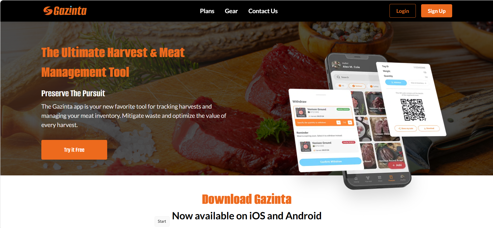
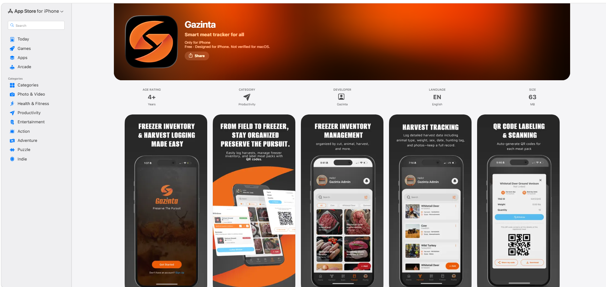
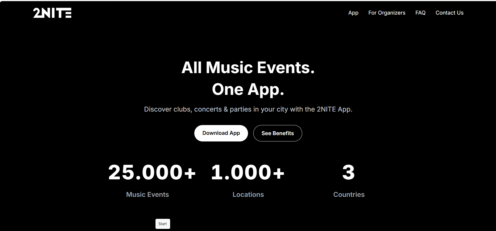
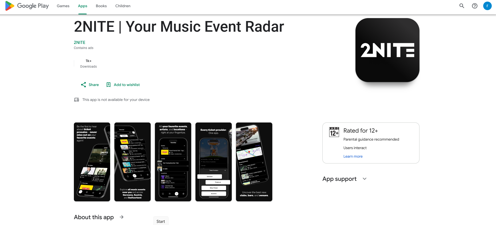
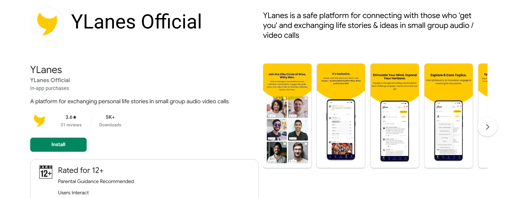
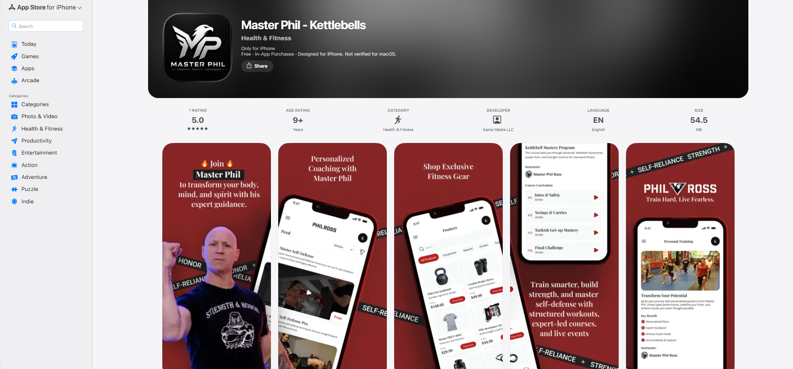
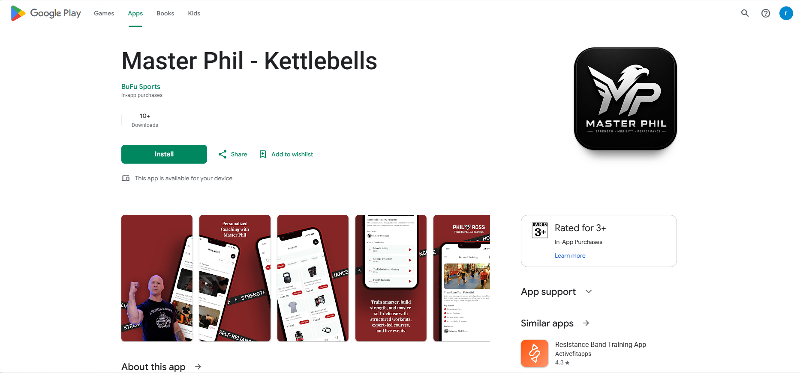
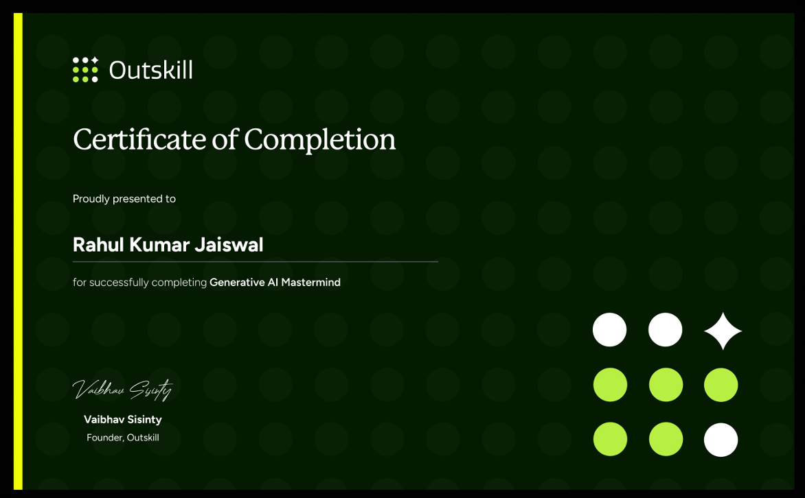

# 👋 Hi, I'm Rahul Kumar Jaiswal

### Senior React Native / Mobile Engineer | React Native • React.js • TypeScript • Generative AI

I'm a **React Native / Mobile Engineer with 7+ years of software development experience**, including **6+ years focused on React Native**, building and shipping production-grade applications for iOS and Android.

My core expertise includes **React Native, React.js, TypeScript, JavaScript, mobile architecture, performance optimization, API integration, payments, real-time features, CI/CD and native platform integration**.

I'm also actively expanding my expertise in **Generative AI and AI-assisted software development**, with a focus on applying AI to modern software engineering and product development.

---

# 🚀 About Me

- 📱 7+ years of software development experience
- ⚛️ 6+ years focused on React Native
- 🌐 React.js and reusable component-driven development
- 📲 Production iOS & Android application development
- 🏗️ Scalable and feature-based mobile architecture
- ⚡ React Native performance optimization
- 💳 Payment & subscription integrations
- 🔥 Firebase & production monitoring
- 🚀 Fastlane & CI/CD automation
- 🔌 REST APIs, GraphQL & Apollo Client
- 🧠 Redux Toolkit, RTK Query, Redux Saga, Zustand & React Query
- 🤖 Generative AI & AI-assisted software development
- 🧩 Native Android/iOS integration
- 🧪 Jest, debugging and production issue resolution

---

# 🛠️ Tech Stack

### 📱 Mobile & Frontend

**React Native • React.js • TypeScript • JavaScript • Expo**

---

### 🔄 State Management & Data

**Redux Toolkit • RTK Query • Redux Saga • Zustand • React Query**

**GraphQL • Apollo Client • REST APIs • API Caching • Pagination**

---

### 🔥 Backend & Services

**Firebase • REST APIs • GraphQL • Apollo Client**

**Authentication • Social Login • Push Notifications • Firebase Cloud Messaging • Analytics • Crashlytics**

---

### 💳 Payments & Monetization

**Stripe • RevenueCat • Superwall • Google AdMob • In-App Purchases • Subscription Systems**

---

### 🎨 UI & Animation

**React Native Reanimated • Gesture Handler • Lottie**

**Responsive UI • Custom Components • Animations • FlatList Optimization • UI Performance**

---

### ⚡ Performance Engineering

- Rendering Optimization
- FlatList / VirtualizedList Optimization
- Memoization
- Avoiding Unnecessary Re-renders
- JavaScript Thread Optimization
- UI Thread Performance
- Animation Optimization
- Startup-Time Optimization
- Lazy Loading
- Image Optimization
- Memory Management
- API / Network Optimization
- Hermes Optimization
- Production Debugging

---

### 🚀 DevOps & CI/CD

**Fastlane • CI/CD • GitHub Actions • AWS Amplify**

**Automated Builds • Release Automation • App Store Deployment • Google Play Deployment**

---

### 📱 Native Development

**Android Java • Kotlin • Swift • Objective-C**

**Native APIs • React Native Native Modules • Native Platform Integration • Native Debugging**

---

### 🧪 Testing & Monitoring

**Jest • Firebase Crashlytics • Production Debugging • Error Monitoring • Code Quality • Testing**

---

### 🤖 AI & Developer Productivity

**Generative AI • Prompt Engineering • AI Agents • AI-assisted Development • AI-powered Workflows**

**ChatGPT • Gemini • GitHub Copilot • Cursor**

---

# 📱 Featured Production Projects

## 🎯 Gazinta

**Smart meat inventory and harvest management platform**

Gazinta helps users track harvests, manage freezer inventory and organize meat packs using QR-based identification.

### Key Features

- React Native mobile application
- Google & Apple authentication
- JWT-based authentication
- QR code generation and scanning
- Harvest and freezer inventory management
- Stripe subscription integration
- Lottie animations
- Custom UI components
- iOS & Android production releases

### Preview

  

  

### Links

🌐 [Gazinta Website](https://gazintaapp.com/)

📱 [App Store](https://apps.apple.com/in/app/gazinta/id6742785888)

🤖 [Google Play](https://play.google.com/store/apps/details?id=com.gazinta)

---

# 🎵 2NITE

**Music event discovery and ticketing application**

2NITE helps users discover clubs, concerts and music events across multiple locations.

### Key Features

- React Native
- TypeScript
- Location-based event discovery
- English / German support
- Timezone-aware event handling
- Firebase Push Notifications
- Google AdMob
- Animated headers and interactive UI
- Dark / Light mode
- Event discovery
- Ticket provider integration
- Custom solution after Firebase Dynamic Links deprecation

### Preview

  

  

### Links

🌐 [2NITE Website](https://www.2nite.eu/en)

📱 [App Store](https://apps.apple.com/app/2nite-dein-musik-event-radar/id6473829066)

🤖 [Google Play](https://play.google.com/store/apps/details?id=com.twonite)

---

# 💬 YLanes

**Audio/video social conversation platform**

YLanes is a platform for connecting users through small-group audio and video conversations.

### Key Features

- React Native
- TypeScript
- Zoom SDK integration
- Audio/video communication
- Small-group conversations
- In-app purchases
- Production iOS & Android application

### Preview

  

### Links

📱 [App Store](https://apps.apple.com/in/app/ylanes/id1634627479)

🤖 [Google Play](https://play.google.com/store/apps/dev?id=8587118635403603529)

---

# 💪 Master Phil - Kettlebells

**Fitness, coaching and training platform**

A fitness application providing structured workouts, coaching content and fitness-related products.

### Key Features

- React Native
- iOS & Android
- Video-based fitness content
- Personalized coaching
- Workout programs
- Product/e-commerce experience
- RevenueCat
- Superwall
- In-App Purchases

### Preview

  

  

### Links

📱 [App Store](https://apps.apple.com/us/app/master-phil-kettlebells/id6751194230)

🤖 [Google Play](https://play.google.com/store/apps/details?id=com.philross)

---

# 🧑‍💻 Other Projects

### 🎾 UTS Live

Live tennis fan engagement platform with live streaming functionality.

**Technologies:** React Native • Video Streaming • APIs

---

### 🏆 Incluzon

Job placement platform with level-based dashboards and an MCQ engine supporting different question formats.

**Technologies:** React Native • REST APIs • State Management

---

### 🃏 The Home Game

Poker tracking application with probability calculations and custom card-selection interactions.

**Technologies:** Expo • React Native • Reanimated • Gesture Handler

---

### 🏃 Ranky

Fitness tracking application built with Android Java and Google Fitness APIs.

**Technologies:** Android Java • Google Fitness API • Fitness Tracking

---

# 📦 Open Source & NPM

### `react-native-country-code-and-currency-picker`

A reusable React Native package for selecting **country codes and currencies** in mobile applications.

**Technologies:** React Native • JavaScript/TypeScript • NPM

📦 **NPM Package:**  
[react-native-country-code-and-currency-picker](https://www.npmjs.com/package/react-native-country-code-and-currency-picker)

This package demonstrates my interest in building **reusable React Native components and developer-focused open-source tooling**.

---

# 🏗️ Architecture & Engineering

I focus on building applications that remain maintainable and scalable as products grow.

### Architecture

- Feature-based architecture
- Modular application structure
- Reusable components
- Separation of concerns
- Scalable state management
- API abstraction
- Error handling
- Authentication architecture

### Data & API

- REST APIs
- GraphQL
- Apollo Client
- RTK Query
- React Query
- Caching
- Pagination
- Cursor-based pagination
- Token refresh
- Offline-first concepts

---

# ⚡ Performance Engineering

Performance is one of my key areas of interest in React Native development.

I work on:

- React rendering optimization
- FlatList / VirtualizedList optimization
- Memoization using `memo`, `useMemo` and `useCallback`
- Preventing unnecessary re-renders
- JavaScript thread optimization
- UI thread performance
- Animation optimization
- Application startup optimization
- Lazy loading
- Image optimization
- Memory management
- Network/API optimization
- Hermes optimization
- Production crash monitoring
- Debugging performance bottlenecks

---

# 🚀 DevOps & Release Engineering

- Fastlane
- CI/CD
- GitHub Actions
- AWS Amplify
- Automated mobile builds
- App Store releases
- Google Play releases
- Production monitoring
- Crashlytics
- Release automation

---

# 🤖 Generative AI

I'm actively building expertise in **Generative AI and AI-assisted software development**.

### Areas of Interest

- Generative AI
- Prompt Engineering
- AI Agents
- AI-powered applications
- AI-assisted coding
- Developer productivity
- AI-driven workflows
- LLM-based product experiences

### 🎓 Certification

**Generative AI Mastermind — Outskill**

Successfully completed the Generative AI Mastermind program.

  

---

# 🎯 Current Focus

React Native
      +
React.js
      +
TypeScript
      +
Mobile Architecture
      +
Performance Engineering
      +
Generative AI
      =
Modern AI-Enabled Mobile Applications

---

# 🤝 Let's Connect

I'm open to opportunities related to:

**Senior React Native Developer • Senior Mobile Engineer • Lead Mobile Developer • React Native Architect**

  
  &nbsp;&nbsp;&nbsp;&nbsp;&nbsp;
  
  &nbsp;&nbsp;&nbsp;&nbsp;&nbsp;
  

---

⭐ Building scalable mobile experiences with React Native & exploring what's next with AI.
